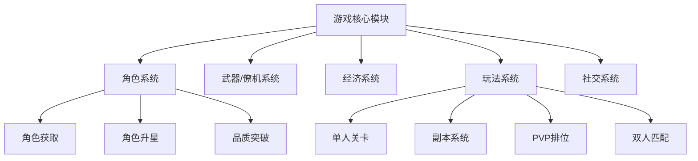

# 游戏名称：GunFire-Heroes

以下是为您设计的Unity 2D横版微信小游戏开发方案，结合微信小游戏特性与商业化需求，分模块详细说明：

---

### **一、游戏整体框架设计**


---

### **二、核心系统实现方案**
#### **1. 角色系统**
- **角色获取机制**  
  - **免费S角色**：累计登录7天发放（用`PlayerPrefs`记录登录状态）  
  - **付费S+角色**：炼狱副本掉落碎片（概率表设计）  
    ```csharp
    // 炼狱副本掉落逻辑
    float dropRate = 0.05f; // 5%基础掉率
    if (Random.value < dropRate + player.LuckBonus) 
        AddShard(selectedCharacter);
    ```
  - **SS~UR角色**：仅能通过碎片升星获得（碎片来源：副本/排位币兑换）

- **升星与突破**  
  - 升星：消耗碎片（S→SS需60碎片，等差递增）  
  - 品质突破：三星时消耗高级材料（材料来源：关卡/Match模式）  
  - **属性平衡规则**：  
    ```csharp
    // 突破角色属性计算（示例）
    float baseValue = character.BaseAttack;
    float breakBonus = isNaturalSR ? baseValue * 0.2f : baseValue * 0.15f; 
    // 原生SR比突破角色高5%属性
    ```

#### **2. 经济系统**
- **充值系统**  
  | 面额（元） | 获得点券 | 赠送点券 | 首充双倍 |  
  |---|---|---|---|  
  | 6 | 60 | 12 | 120 |  
  | 648 | 6480 | 1296 | 12960 |  
  - **技术实现**：集成微信支付SDK，需处理异步回调  
    ```csharp
    WX.RequestPayment(new PaymentParams{
        totalFee = amount,
        success = () => AddCurrency(amount * 10 + bonus)
    });
    ```

- **礼包系统**  
  - **首充礼包**：A+角色 + 金币 + 武器材料（触发条件：首次充值任意金额）  
  - **随机礼包**：按权重随机组合（算法示例）：  
    ```csharp
    List<GiftPack> pools = new List<GiftPack>{ 
        new GiftPack{roleShards=10, weight=30},
        new GiftPack{weaponMaterials=50, weight=70} 
    };
    GiftPack selected = WeightedRandom.Select(pools);
    ```

#### **3. 玩法系统**
- **副本结构**  
  | 副本类型 | 难度 | 掉落物品 |  
  |---|---|---|  
  | 角色碎片 | 炼狱 | S角色碎片（5%） |  
  | 武器材料 | 地狱 | 金色突破材料 |  
  | 金币副本 | 简单 | 金币×5000 |  

- **多人玩法**  
  - **PVP排位**：实时对战（采用Photon引擎），奖励排位币  
  - **双人匹配**：  
    - 时间限定：8:00-23:00  
    - 动态关卡：每日从520关卡中随机选取  
    - 奖励：代币兑换SSR碎片（兑换比例1代币=1碎片）

---

### **三、微信小游戏专项优化**
1. **包体控制**  
   - 首包≤4MB：角色/武器资源动态加载（Addressables系统）  
   - 纹理压缩：WebP格式替代PNG（节省30%空间）  
   - 音频优化：背景音乐用MP3（128kbps），音效用OGG

2. **微信API集成**  
   ```csharp
   // 微信登录集成
   WX.Login(res => {
       if(res.code != null) 
           Server.VerifyCode(res.code); // 向服务器验证
   });
   ```
   - 社交功能：排行榜（`WX.GetFriendCloudStorage`） + 分享（`WX.ShareAppMessage`）

3. **性能优化**  
   - 对象池管理弹幕/敌人（避免GC卡顿）  
   - DrawCall控制：静态合批（Static Batching） + 精灵图集  
   - 内存监控：自动降级画质（低端机关闭粒子特效）

---

### **四、开发流程图**
```mermaid
sequenceDiagram
    玩家->>Unity客户端： 登录游戏
    Unity客户端->>微信服务器： 调用WX.Login()
    微信服务器-->>Unity客户端： 返回code
    Unity客户端->>游戏服务器： 发送code验证
    游戏服务器->>微信服务器： 校验session_key
    微信服务器-->>游戏服务器： 返回openid
    游戏服务器-->>Unity客户端： 下发角色数据
    玩家->>副本系统： 挑战炼狱副本
    副本系统-->>游戏服务器： 请求掉落计算
    游戏服务器-->>Unity客户端： 返回碎片掉落
```

---

### **五、扩展设计建议**
1. **反作弊机制**  
   - PVP战斗数据二次校验（服务器重算关键伤害）  
   - 副本掉落记录MD5加密（防篡改）

2. **运营功能**  
   - 七日任务系统（引导新手）  
   - 限时活动（双倍碎片掉落）  
   - 看广告复活（激励视频接入）

3. **美术规范**  
   - 角色尺寸≤512×512像素（适配竖屏转横屏）  
   - 粒子特效顶点数≤100（微信小游戏GPU限制）

---

**发布流程**：  
1. Unity导出WebGL → 微信转换工具 → 配置分包（≤20MB总包）  
2. 真机测试：重点验证支付回调/内存泄漏  
3. 提审注意：公示抽卡概率（文化部要求）

此方案已平衡商业化需求与技术可行性，关键模块可参考微信官方Unity插件示例代码实现。开发中需持续监控微信开发者工具的性能面板（内存>100MB时触发优化警报）。
